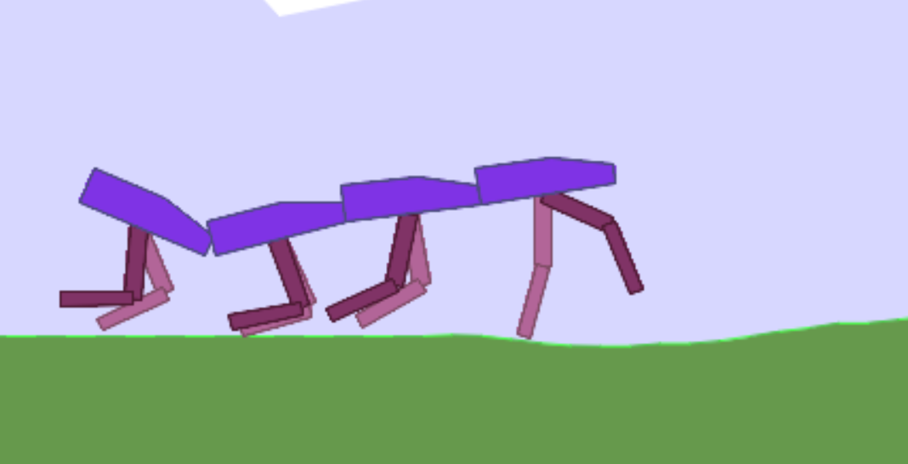

# IDRL-Env: Aggregated Robot Locomotion Environment

[](LICENSE)
[](https://www.python.org/)
[]()

**IDRL-Env** is a custom Reinforcement Learning (RL) environment library designed for **Multi-Agent Locomotion** and **Aggregated Robot Control**, built upon OpenAI Gymnasium and Box2D. 

This repository serves as the simulation testbed for research into controlling complex, multi-segment coupled robots (e.g., "Centipede" morphology) and benchmarking high-dimensional continuous control algorithms.

<p align="center">
  
  <br>
  <em>Figure 1: Visualization of the BipedalWalkerAgg environment with coupled segments.</em>
</p>

## 🚀 Key Features

* **Aggregated Morphology**: Simulates physically coupled multi-agent systems where multiple `BipedalWalker` units form a chain-like structure.
* **High-Dimensional Control**: Challenges RL agents with expanded state-action spaces (up to `14 * n` state dimensions), requiring robust exploration strategies.
* **Customizable Topology**: Supports variable number of aggregated units (`n_contents`) to test scalability of control policies.
* **Baselines Included**: Provides a clean, purely PyTorch-based implementation of **TD3 (Twin Delayed DDPG)** tailored for this environment.

## 🛠️ Installation

### Prerequisites
* Python 3.9+
* PyTorch 2.0+ (with CUDA support recommended)

### Setup via Pip

```bash
# 1. Clone the repository
git clone [https://github.com/YOUR_USERNAME/idrlenv.git](https://github.com/YOUR_USERNAME/idrlenv.git)
cd idrlenv

# 2. Install the package in editable mode
pip install -e .

# 3. Install dependencies
pip install "gymnasium[box2d]" tyro tensorboard stable-baselines3